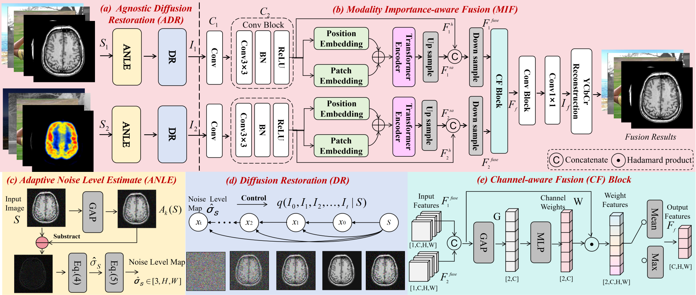

# NA-MMIF: A Noise-agnostic Multi-modal Image Fusion Framework

Official implementation of **NA-MMIF**.

> **NA-MMIF: A Noise-agnostic Multi-modal Image Fusion Framework**  
> Pudu Liu, Wei Lu, Zhida Chen, Ying Huang, Jianqing Zhu, Huanqiang Zeng  
> Huaqiao University & Xiamen Solex High-Tech Industries Co., Ltd

---

## Framework



---

## Requirements

- Python 3.10
- PyTorch 2.5.1 + CUDA 12.1

```bash
pip install -r requirements.txt
```

---

## Inference

**Multi-Exposure Fusion (MEFB):**

```bash
CUDA_VISIBLE_DEVICES=0 python main_MEFB_adaptive.py --config imagenet_256_auto_MEFB.yml
```

**Infrared-Visible Fusion (TNO):**

```bash
CUDA_VISIBLE_DEVICES=0 python main_TNO_adaptive.py --config imagenet_256_auto_TNO.yml
```

**Multi-focus Fusion (Lytro):**

```bash
CUDA_VISIBLE_DEVICES=0 python main_Lytro_adaptive.py --config imagenet_256_auto_Lytro.yml
```

**Infrared-Visible Fusion (Roadscene):**

```bash
CUDA_VISIBLE_DEVICES=0 python main_Road_adaptive.py --config imagenet_256_auto_Roadscene.yml
```

**PET-MRI Fusion:**

```bash
CUDA_VISIBLE_DEVICES=0 python main_PET_adaptive.py --config imagenet_256_auto_PET.yml
```

**CT-MRI Fusion:**

```bash
CUDA_VISIBLE_DEVICES=0 python main_CT_adaptive.py --config imagenet_256_auto_CT.yml
```

---

## License

This project is released under the MIT License.